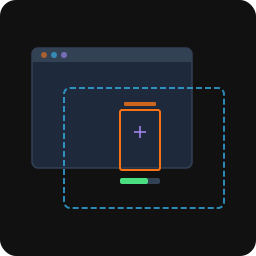
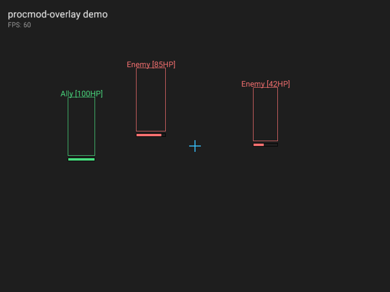

<p align="center">

</p>

<h1 align="center">procmod-overlay</h1>

<p align="center">Game overlay rendering with transparent click-through windows.</p>

---

Create a transparent, click-through overlay window on top of any game window and draw shapes, text, and HUD elements. Direct3D 11 backend, immediate-mode API, built-in font rendering.

<p align="center">

<br>
<sub>Live output from the included demo binary. The dark background is a stand-in for a game window.</sub>
</p>

## Install

```toml
[dependencies]
procmod-overlay = "2.1.0"
```

## Quick start

Draw status information and projected debug geometry over a game window:

```rust
use procmod_overlay::{Overlay, OverlayTarget, Color};

fn main() -> procmod_overlay::Result<()> {
    let mut overlay = Overlay::new(OverlayTarget::Title("My Game".into()))?;

    loop {
        overlay.begin_frame()?;

        overlay.rect(100.0, 50.0, 60.0, 120.0, Color::RED);
        overlay.rect_filled(100.0, 175.0, 45.0, 8.0, Color::GREEN);
        overlay.text(20.0, 20.0, "instrumentation active", 16.0, Color::WHITE);

        overlay.end_frame()?;
    }
}
```

## Usage

### Creating an overlay

Find the target window by title, class name, HWND, or process ID:

```rust
// by window title (substring match)
let overlay = Overlay::new(OverlayTarget::Title("Counter-Strike".into()))?;

// by window class
let overlay = Overlay::new(OverlayTarget::Class("UnrealWindow".into()))?;

// by process ID
let overlay = Overlay::new(OverlayTarget::Pid(1234))?;

// by raw HWND
let overlay = Overlay::new(OverlayTarget::Hwnd(0x00010A3C))?;
```

PID lookup only enumerates windows on the caller's current interactive desktop. The overlay must run in the logged-in desktop session that contains the target window. A process started directly from a noninteractive SSH session cannot discover windows on another desktop or session.

`ProcessNotFound` means the PID does not exist or cannot be queried. `ProcessWindowNotFound` means the process exists but has no visible top-level window on the current desktop. Windows does not expose enough information here to reliably distinguish a process with no window from one whose window belongs to another desktop or session.

### Interaction

Overlays are click-through and non-activating by default. Applications can explicitly enter an interactive control mode and consume window input events:

```rust
use procmod_overlay::{InputEvent, InteractionMode, MouseButton};

overlay.set_interaction_mode(InteractionMode::Interactive)?;

for event in overlay.drain_input_events() {
    match event {
        InputEvent::MouseButton {
            button: MouseButton::Left,
            pressed: false,
            x,
            y,
        } => println!("clicked at {x}, {y}"),
        InputEvent::Key {
            virtual_key: 0x1b,
            ..
        } => overlay.set_interaction_mode(InteractionMode::PassThrough)?,
        _ => {}
    }
}
```

`Interactive` removes click-through and no-activate styles, activates the overlay, displays its cursor, and reports mouse, wheel, keyboard, text, focus, and close events. Returning to `PassThrough` releases mouse capture and restores focus to the target window. Applications own hit testing, widgets, key bindings, and menu state.

### Lifecycle

`begin_frame` reports `OverlayClosed` when the overlay window closes and `TargetWindowLost` when the target HWND is destroyed or becomes inaccessible. Renderer failures remain renderer errors. The consumer owns reconnection policy and any application-state reset after reconnecting.

### Drawing shapes

All drawing happens between `begin_frame` and `end_frame`:

```rust
overlay.begin_frame()?;

// filled and outlined rectangles
overlay.rect_filled(10.0, 10.0, 200.0, 30.0, Color::rgba(0, 0, 0, 180));
overlay.rect(10.0, 10.0, 200.0, 30.0, Color::WHITE);

// lines
overlay.line(0.0, 0.0, 100.0, 100.0, 2.0, Color::RED);

// circles
overlay.circle_filled(150.0, 150.0, 20.0, Color::rgba(56, 189, 248, 128));
overlay.circle(150.0, 150.0, 20.0, Color::CYAN);

overlay.end_frame()?;
```

### Drawing text

Text rendering uses an embedded font with configurable size:

```rust
overlay.text(20.0, 20.0, "Player1 [100HP]", 16.0, Color::WHITE);
overlay.text(20.0, 40.0, "Distance: 42m", 12.0, Color::YELLOW);

// measure text bounds before drawing
let (w, h) = overlay.text_bounds("centered text", 16.0);
overlay.text(320.0 - w / 2.0, 10.0, "centered text", 16.0, Color::WHITE);
```

## Platform support

| Platform | Backend | Status |
|----------|---------|--------|
| Windows  | Direct3D 11 | Supported |
| Linux    | - | Planned |
| macOS    | - | Planned |

The crate compiles on all platforms but only exports the overlay API on Windows.

## How it works

The overlay creates a transparent, always-on-top window (`WS_EX_LAYERED | WS_EX_TRANSPARENT`) positioned over the target game window. All mouse and keyboard input passes through to the game. The overlay tracks the target window's position and resizes automatically.

Rendering uses Direct3D 11 with alpha blending. Shapes are batched into vertex/index buffers and drawn in minimal draw calls. Text is rasterized into a glyph atlas at startup and rendered as textured quads.

## Demo

Run the visual demo on Windows to see the overlay in action:

```
cargo run --example demo
```

This creates a dark window simulating a game scene, overlays it with ESP boxes, health bars, a crosshair, and text labels. The screenshot above was captured from this demo.

## License

MIT
